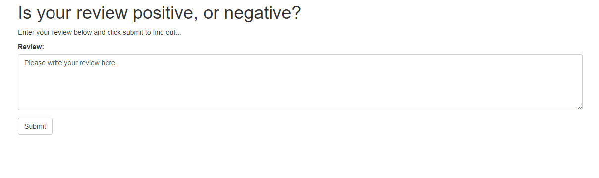
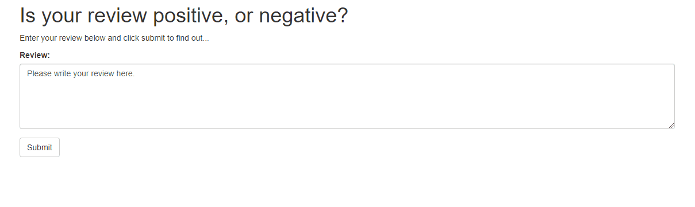

# Deploying a Sentiment Analysis model on Amazon SageMaker 
This repository is my solution to `Project 5` of Udacity's [Deep Learning Nanodegree](https://www.udacity.com/course/deep-learning-nanodegree--nd101). In this project, I built a machine learning workflow with the following tasks:

1. Downloading the IMDb movie review [dataset](http://ai.stanford.edu/~amaas/data/sentiment/)
2. Processing the data
3. Uploading the processed data to Amazon S3 (Simple Storage Service)
4. Training an LSTM classifier model with embeddings
5. Testing the trained model (using a batch transform job)
6. Deploying the testing model
7. Using the deployed model in a web app

More information about these steps is present in the [notebook](https://github.com/hash-ir/Sentiment-Analysis-Deployment/blob/master/SageMaker%20Project.ipynb). The deployment of the model in the web app makes use of two Amazon services - Lambda and API Gateway. Creating a Lambda function allows it to send and retrieve data from the deployed model. An API Gateway acts as an interface that lets the web app communicate with the Lambda function.

  

`website/index.html` is the web app which sends and receive data to the deployed API gateway. The web app would not work since the SageMaker endpoint is deleted. To train, test and deploy the model on your own, follow the steps given in the [notebook](https://github.com/hash-ir/Sentiment-Analysis-Deployment/blob/master/SageMaker%20Project.ipynb). A demo of the web app is provided below

## Demo

## Author(s)
* **Hashir Ahmad** - *full project* - [GitHub](https://github.com/hash-ir)

## License
This project is licensed under the MIT License - see the [LICENSE](https://github.com/hash-ir/Sentiment-Analysis-Deployment/blob/master/LICENSE) file for details
